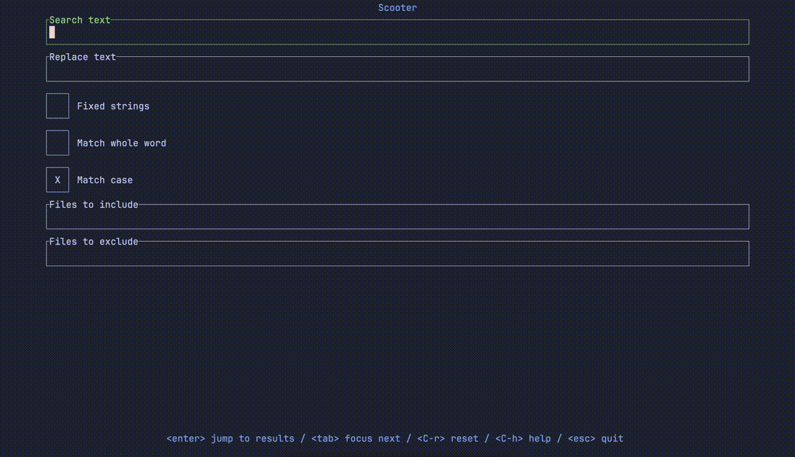

# scooter

Scooter is an interactive find-and-replace terminal UI app.

Search with either a fixed string or a regular expression, enter a replacement, and interactively toggle which instances you want to replace.

If the instance you're attempting to replace has changed since the search was performed, e.g. if you've switched branches and that line no longer exists, that particular replacement won't occur: you'll see all such cases at the end.



You can use custom themes for syntax highlighting (see [here](#syntax_highlighting_theme) for more info):


## Contents

<!-- TOC START -->
- [Features](#features)
- [Usage](#usage)
  - [Search fields](#search-fields)
- [Performance](#performance)
- [Installation](#installation)
  - [Homebrew](#homebrew)
  - [Nix](#nix)
  - [AUR](#aur)
  - [Winget](#winget)
  - [NetBSD](#netbsd)
  - [Prebuilt binaries](#prebuilt-binaries)
  - [Cargo](#cargo)
  - [Building from source](#building-from-source)
- [Configuration options](#configuration-options)
- [Editor configuration](#editor-configuration)
  - [Helix](#helix)
  - [Neovim](#neovim)
- [Contributing](#contributing)
  - [Development](#development)
<!-- TOC END -->


## Features

Scooter respects both `.gitignore` and `.ignore` files.

You can add capture groups to the search regex and use them in the replacement string: for instance, if you use `(\d) - (\w+)` for the search text and `($2) "$1"` as the replacement, then `9 - foo` would be replaced with `(foo) "9"`.

When viewing search results, you can open the selected file at the relevant line by pressing `e`. This will use the editor defined by your `EDITOR` environment variable. Scooter will automatically attempt to open the editor at the correct line number, but if you'd like to override the command used then you can set `editor_open` in your [config file](#configuration-options).


## Usage

Run

```sh
scooter
```

in a terminal to launch Scooter. By default the current directory is used to search and replace in, but you can pass in a directory as the first argument to override this behaviour:

```sh
scooter ../foo/bar
```

A set of keymappings will be shown at the bottom of the window: these vary slightly depending on the screen you're on.

By default, Scooter uses a regex engine that supports only a subset of features to maximise performance. To use the full range of regex features, such as negative lookahead, start Scooter with the `-a` (`--advanced-regex`) flag.

Hidden files (such as those starting with a `.`) are ignored by default, but can be included by using the `--hidden` flag.

### Search fields

When on the search screen the following fields are available:

- **Search text**: Text to search with. Defaults to regex, unless "Fixed strings" is enabled, in which case this reverts to case-sensitive string search.
- **Replace text**: Text to replace the search text with. If searching with regex, this can include capture groups.
- **Fixed strings**: If enabled, search with plain strings. If disabled, search with regex.
- **Match whole word**: If enabled, only match when the search string forms an entire word and not a substring in a larger word. For instance, if the search string is "foo", "foo bar" would be matched but not "foobar".
- **Match case**: If enabled, match the case of the search string exactly, e.g. a search string of `Bar` would match `foo Bar baz` but not `foo bar baz`.
- **Files to include**: Glob patterns, separated by commas (`,`), that file paths must match. For instance, `*.rs, *.py` matches all files with the `.rs` or `.py` extensions.
- **Files to exclude**: Glob patterns, separated by commas (`,`), that file paths must not match. For instance, `env/**` ignores all files in the `env` directory. This field takes precedence over the pattern in the "Files to include" field.

Note that the glob matching library used in Scooter comes from the brilliant [ripgrep](https://github.com/BurntSushi/ripgrep), and matches the behaviour there: for instance, if you wanted to include only files in the directory `dir1`, you'd need to add `dir1/**` in the "Files to include" field - `dir1` alone would not work.

#### Pre-populating search fields

You can pre-populate the search fields using command-line flags, for instance:

```sh
scooter \
  --search-text "old" \
  --replace-text "new" \
  --fixed-strings \
  --files-to-include "*.rs,*.py"
```

Note that, by default, pre-populated fields are disabled in the UI. To make these fields editable by default, you can set `search.disable_prepopulated_fields` to `false` in your config - see [here](#disable_prepopulated_fields).
You can also temporarily unlock the pre-populated fields with `ctrl+u`.

When pre-populating the fields in this way, you can skip the initial search screen entirely and jump straight to searching with the `--immediate-search` flag, e.g.:

```sh
scooter --search-text "old" --replace-text "new" --immediate-search
```

Run `scooter --help` to see the full list of command-line args that can be used to pre-populate fields.


## Performance

Scooter is fast. Below is a benchmark for comparison, performing a find and replace on the entire [Linux kernel](https://github.com/torvalds/linux), finding and replacing the string "before" with "after":

<!-- BENCHMARK START -->
| Command | Mean [s] | Min [s] | Max [s] | Relative |
|:---|---:|---:|---:|---:|
| `scooter` | 6.403 ± 0.093 | 6.287 | 6.543 | 1.46 ± 0.03 |
| `scooter (--no-tui)` | 4.491 ± 0.066 | 4.424 | 4.572 | 1.02 ± 0.02 |
| `ripgrep + sd` | 4.894 ± 0.061 | 4.816 | 4.964 | 1.11 ± 0.03 |
| `fastmod` | 4.395 ± 0.084 | 4.322 | 4.533 | 1.00 |
| `fd + sd` | 10.010 ± 0.000 | 10.010 | 10.011 | 2.28 ± 0.04 |

<!-- BENCHMARK END -->

Much of the speed is thanks to using the [ripgrep](https://github.com/BurntSushi/ripgrep) file walker, found in the [ignore](https://github.com/BurntSushi/ripgrep/tree/master/crates/ignore) crate.

The `--no-tui` (`-N`) mode can be used like so:

```sh
scooter -N -s before -r after
```

Run `scooter --help` for a full list of flags.


## Installation

[](https://repology.org/project/scooter/versions)

### Homebrew

On macOS and Linux, you can install Scooter using [Homebrew](https://formulae.brew.sh/formula/scooter):

```sh
brew install scooter
```

### Nix

Scooter is available as `scooter` in [nixpkgs](https://search.nixos.org/packages?channel=unstable&show=scooter), currently on the unstable channel.

### AUR

Install from the Arch User Repository with:

```
yay -S scooter
```

Or, to build from the latest commit:

```
yay -S scooter-git
```

### Winget

Install from Winget with

```sh
winget install thomasschafer.scooter
```

### NetBSD

Install from the official repositories with:

```sh
pkgin install scooter
```

### Prebuilt binaries

Download the appropriate binary for your system from the [releases page](https://github.com/thomasschafer/scooter/releases/latest):

| Platform | Architecture | Download file |
|-|-|-|
| Linux | Intel/AMD | `*-x86_64-unknown-linux-musl.tar.gz` |
| Linux | ARM64 | `*-aarch64-unknown-linux-musl.tar.gz` |
| macOS | Apple Silicon| `*-aarch64-apple-darwin.tar.gz` |
| macOS | Intel | `*-x86_64-apple-darwin.tar.gz` |
| Windows | x64 | `*-x86_64-pc-windows-msvc.zip` |

After downloading, extract the binary and move it to a directory in your `PATH`.

### Cargo

Ensure you have cargo installed (see [here](https://doc.rust-lang.org/cargo/getting-started/installation.html)), then run:

```sh
cargo install scooter
```

### Building from source

Ensure you have cargo installed (see [here](https://doc.rust-lang.org/cargo/getting-started/installation.html)), then run the following commands:

```sh
git clone git@github.com:thomasschafer/scooter.git
cd scooter
cargo install --path scooter --locked
```


## Configuration options

Scooter looks for a TOML configuration file at:

- Linux or macOS: `~/.config/scooter/config.toml`
- Windows: `%AppData%\scooter\config.toml`

The following options can be set in your configuration file:

<!-- CONFIG START -->
### `[editor_open]` section

#### `command`

The command used when pressing `e` on the search results page. Two variables are available: `%file`, which will be replaced
with the file path of the search result, and `%line`, which will be replaced with the line number of the result. For example:
```toml
[editor_open]
command = "vi %file +%line"
```
If not set explicitly, Scooter will attempt to use the editor set by the `$EDITOR` environment variable.

#### `exit`

Whether to exit Scooter after running the command defined by `editor_open.command`. Defaults to `false`.

### `[preview]` section

#### `syntax_highlighting`

Whether to apply syntax highlighting to the preview. Defaults to `true`.

#### `syntax_highlighting_theme`

The theme to use when syntax highlighting is enabled.

The default is `"base16-eighties.dark"`. Other built-in options are
`"base16-mocha.dark"`, `"base16-ocean.dark"`, `"base16-ocean.light"`, `"InspiredGitHub"`, `"Solarized (dark)"` and `"Solarized (light)"`.

You can use other themes by adding `.tmTheme` files to `~/.config/scooter/themes/` on Linux or macOS, or `%AppData%\scooter\themes\` on Windows,
and then specifying their name here. For instance, to use Catppuccin Macchiato (from [here](https://github.com/catppuccin/bat)), on Linux or macOS run:
```sh
wget -P ~/.config/scooter/themes https://github.com/catppuccin/bat/raw/main/themes/Catppuccin%20Macchiato.tmTheme
```
and then set `syntax_highlighting_theme = "Catppuccin Macchiato"`.

### `[style]` section

#### `true_color`

Force enable or disable true color. `true` forces true color (supported by most modern terminals but not e.g. Apple Terminal), while `false` forces 256 colors (supported by almost all terminals including Apple Terminal).
If omitted, Scooter will attempt to determine whether the terminal being used supports true color.

### `[search]` section

#### `disable_prepopulated_fields`

Whether to disable fields set by CLI flags. Set to `false` to allow editing of these pre-populated fields. Defaults to `true`.

<!-- CONFIG END -->


## Editor configuration

Below are a couple of ways to run Scooter without leaving your editor.

### Helix

As explained [here](https://github.com/helix-editor/helix/wiki/Recipes#project-wide-search-and-replace-with-scooter), you can add a keybinding like the following to open Scooter directly in Helix with `<enter> s`:

```toml
[keys.select.ret]
s = [
    ":write-all",
    ":insert-output scooter >/dev/tty",
    ":redraw",
    ":reload-all"
]
```

Note that this saves all files before opening Scooter.

#### Floating window

If you are using Helix in Tmux, you can add a keymap like the following to your Helix config to open Scooter in a popup with `<enter> s`:

```toml
[keys.select.ret]
s = ":sh tmux popup -xC -yC -w90% -h90% -E scooter"
```

You can also add the following to your [Scooter config file](#configuration-options) to open files back in Helix from the search results page with `e`:

```toml
[editor_open]
command = 'tmux send-keys -t "$TMUX_PANE" ":open %file:%line" Enter'
exit = true
```


### Neovim

Install Toggleterm as per the instructions [here](https://github.com/akinsho/toggleterm.nvim?tab=readme-ov-file#installation), and then add the following Lua configuration, which opens up Scooter with `<leader>s`:

```lua
local Terminal = require("toggleterm.terminal").Terminal

local scooter = Terminal:new({ cmd = "scooter", hidden = true })

function _scooter_toggle()
  scooter:toggle()
end

vim.keymap.set("n", "<leader>s", "<cmd>lua _scooter_toggle()<CR>", {
  noremap = true,
  silent = true,
  desc = "Toggle Scooter"
})
```

## Contributing

Contributions are very welcome! I'd be especially grateful for any contributions to add Scooter to popular package managers. If you'd like to add a new feature, please create an issue first so we can discuss the idea, then create a PR with your changes.

### Development

Once you've pulled down the repo, you can run Scooter with:

```sh
cargo run --bin scooter
```

If you make any changes to either the readme or config, you'll need to run the following to regenerate the docs:

```sh
cargo xtask readme
```
