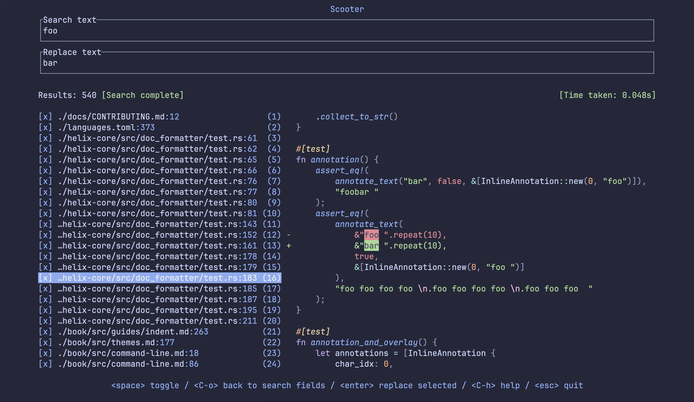

# scooter

scooter is an interactive find-and-replace terminal UI app. By default it recursively searches through files in the current directory, but can also be used to process text from stdin.

Search with either a fixed string or a regular expression, enter a replacement, and interactively toggle which instances you want to replace. If the instance you're attempting to replace has changed since the search was performed, e.g. if you've switched branches and that line no longer exists, that particular replacement won't occur: you'll see all such cases at the end.


You can use custom themes for syntax highlighting (see [here](#syntax_highlighting_theme) for more info):



## Contents

<!-- TOC START -->
- [Features](#features)
- [Usage](#usage)
  - [Files](#files)
  - [Stdin](#stdin)
  - [Search fields](#search-fields)
- [Performance](#performance)
- [Installation](#installation)
  - [Homebrew](#homebrew)
  - [Nix](#nix)
  - [AUR](#aur)
  - [Winget](#winget)
  - [Scoop](#scoop)
  - [NetBSD](#netbsd)
  - [Prebuilt binaries](#prebuilt-binaries)
  - [Cargo](#cargo)
  - [Building from source](#building-from-source)
- [Configuration options](#configuration-options)
- [Editor configuration](#editor-configuration)
  - [Helix](#helix)
  - [Neovim](#neovim)
- [Contributing](#contributing)
  - [Development](#development)
<!-- TOC END -->


## Features

A set of keymappings will be shown at the bottom of the window: these vary slightly depending on the screen you're on.

When searching through files, scooter respects both `.gitignore` and `.ignore` files.

You can add capture groups to the search regex and use them in the replacement string: for instance, if you use `(\d) - (\w+)` for the search text and `($2) "$1"` as the replacement, then `9 - foo` would be replaced with `(foo) "9"`.

When viewing search results, you can open the selected file at the relevant line by pressing `e`. This will use the editor defined by your `EDITOR` environment variable. scooter will automatically attempt to open the editor at the correct line number, but if you'd like to override the command used then you can set `editor_open` in your [config file](#configuration-options).

By default, scooter uses a regex engine that supports only a subset of features to maximise performance. To use the full range of regex features, such as negative lookahead, start scooter with the `-a` (`--advanced-regex`) flag.

Hidden files (such as those starting with a `.`) are ignored by default, but can be included by using the `--hidden` flag.


## Usage

### Files

Run

```sh
scooter
```

in a terminal to launch scooter. By default the current directory is used to search and replace in, but you can pass in a directory as the first argument to override this behaviour:

```sh
scooter ../foo/bar
```

### Stdin

scooter can operate on content piped from stdin. For instance:

```sh
echo "hello world" | scooter
```

In standard TUI mode the results are written to stderr, to avoid clashing with the TUI which writes to stdout. Given this, you can write the results using `2>`, e.g.:

```sh
cat input.txt | scooter 2> output.txt
```

In `--no-tui` mode (`-N`), the results are instead written to stdout. For example:

```sh
cat input.txt | scooter -N -s before -r after > output.txt
```

### Search fields

When on the search screen the following fields are available:

- **Search text**: Text to search with. Defaults to regex, unless "Fixed strings" is enabled, in which case this reverts to case-sensitive string search.
- **Replace text**: Text to replace the search text with. If searching with regex, this can include capture groups.
- **Fixed strings**: If enabled, search with plain strings. If disabled, search with regex.
- **Match whole word**: If enabled, only match when the search string forms an entire word and not a substring in a larger word. For instance, if the search string is "foo", "foo bar" would be matched but not "foobar".
- **Match case**: If enabled, match the case of the search string exactly, e.g. a search string of `Bar` would match `foo Bar baz` but not `foo bar baz`.
- **Files to include**: Glob patterns, separated by commas (`,`), that file paths must match. For instance, `*.rs, *.py` matches all files with the `.rs` or `.py` extensions.
- **Files to exclude**: Glob patterns, separated by commas (`,`), that file paths must not match. For instance, `env/**` ignores all files in the `env` directory. This field takes precedence over the pattern in the "Files to include" field.

Note that the glob matching library used in scooter comes from the brilliant [ripgrep](https://github.com/BurntSushi/ripgrep), and matches the behaviour there: for instance, if you wanted to include only files in the directory `dir1`, you'd need to add `dir1/**` in the "Files to include" field - `dir1` alone would not work.

#### Pre-populating search fields

You can pre-populate the search fields using command-line flags, for instance:

```sh
scooter \
  --search-text "old" \
  --replace-text "new" \
  --fixed-strings \
  --files-to-include "*.rs,*.py"
```

Note that, by default, pre-populated fields are disabled in the UI. To make these fields editable by default, you can set `search.disable_prepopulated_fields` to `false` in your config - see [here](#disable_prepopulated_fields).
You can also temporarily unlock the pre-populated fields with `<alt>+u`.

When pre-populating the fields in this way, you can skip the initial search screen entirely and jump straight to searching with the `--immediate-search` flag, e.g.:

```sh
scooter --search-text "old" --replace-text "new" --immediate-search
```

Run `scooter --help` to see the full list of command-line args that can be used to pre-populate fields.


## Performance

scooter is fast. Below is a benchmark for comparison, performing a find and replace on the entire [Linux kernel](https://github.com/torvalds/linux), finding and replacing the string "before" with "after":

<!-- BENCHMARK START -->
| Command | Mean [s] | Min [s] | Max [s] | Relative |
|:---|---:|---:|---:|---:|
| `scooter` | 6.403 ± 0.093 | 6.287 | 6.543 | 1.46 ± 0.03 |
| `scooter (--no-tui)` | 4.491 ± 0.066 | 4.424 | 4.572 | 1.02 ± 0.02 |
| `ripgrep + sd` | 4.894 ± 0.061 | 4.816 | 4.964 | 1.11 ± 0.03 |
| `fastmod` | 4.395 ± 0.084 | 4.322 | 4.533 | 1.00 |
| `fd + sd` | 10.010 ± 0.000 | 10.010 | 10.011 | 2.28 ± 0.04 |

<!-- BENCHMARK END -->

Much of the speed is thanks to using the [ripgrep](https://github.com/BurntSushi/ripgrep) file walker, found in the [ignore](https://github.com/BurntSushi/ripgrep/tree/master/crates/ignore) crate.

Run `scooter --help` for a full list of flags.


## Installation

[](https://repology.org/project/scooter/versions)

### Homebrew

On macOS and Linux, you can install scooter using [Homebrew](https://formulae.brew.sh/formula/scooter):

```sh
brew install scooter
```

### Nix

scooter is available as `scooter` in [nixpkgs](https://search.nixos.org/packages?show=scooter).

### AUR

Install from the Arch User Repository with:

```
yay -S scooter
```

Or, to build from the latest commit:

```
yay -S scooter-git
```

### Winget

Install from Winget with

```sh
winget install thomasschafer.scooter
```

### Scoop

On Windows, you can install scooter using [Scoop](https://scoop.sh/#/apps?q=scooter&p=1&id=e0378d34e35574873c593119f965372f17d74c9f):

```sh
scoop install scooter
```

### NetBSD

Install from the official repositories with:

```sh
pkgin install scooter
```

### Prebuilt binaries

Download the appropriate binary for your system from the [releases page](https://github.com/thomasschafer/scooter/releases/latest):

| Platform | Architecture | Download file |
|-|-|-|
| Linux | Intel/AMD | `*-x86_64-unknown-linux-musl.tar.gz` |
| Linux | ARM64 | `*-aarch64-unknown-linux-musl.tar.gz` |
| macOS | Apple Silicon| `*-aarch64-apple-darwin.tar.gz` |
| macOS | Intel | `*-x86_64-apple-darwin.tar.gz` |
| Windows | x64 | `*-x86_64-pc-windows-msvc.zip` |

After downloading, extract the binary and move it to a directory in your `PATH`.

### Cargo

Ensure you have cargo installed (see [here](https://doc.rust-lang.org/cargo/getting-started/installation.html)), then run:

```sh
cargo install scooter
```

### Building from source

Ensure you have cargo installed (see [here](https://doc.rust-lang.org/cargo/getting-started/installation.html)), then run the following commands:

```sh
git clone git@github.com:thomasschafer/scooter.git
cd scooter
cargo install --path scooter --locked
```


## Configuration options

By default, scooter looks for a TOML configuration file at:

- Linux or macOS: `~/.config/scooter/config.toml`
- Windows: `%AppData%\scooter\config.toml`

You can override the config directory by using the `--config-dir` flag.

The following options can be set in your configuration file:

<!-- CONFIG START -->
### `[editor_open]` section

#### `command`

The command used when pressing `e` on the search results page. Two variables are available: `%file`, which will be replaced
with the file path of the search result, and `%line`, which will be replaced with the line number of the result. For example:
```toml
[editor_open]
command = "vi %file +%line"
```
If not set explicitly, scooter will attempt to use the editor set by the `$EDITOR` environment variable.

This can be overridden using the `--editor-command` flag, for example: `scooter --editor-command "vi %file +%line"`.

#### `exit`

Whether to exit scooter after running the command defined by `editor_open.command`. Defaults to `false`.

### `[preview]` section

#### `syntax_highlighting`

Whether to apply syntax highlighting to the preview. Defaults to `true`.

#### `syntax_highlighting_theme`

The theme to use when syntax highlighting is enabled.

The default is `"base16-eighties.dark"`. Other built-in options are
`"base16-mocha.dark"`, `"base16-ocean.dark"`, `"base16-ocean.light"`, `"InspiredGitHub"`, `"Solarized (dark)"` and `"Solarized (light)"`.

You can use other themes by adding `.tmTheme` files to `<scooter-config-dir>/themes` and then specifying their name here.
By default, `<scooter-config-dir>` is `~/.config/scooter/` on Linux or macOS, or `%AppData%\scooter\` on Windows, and can be overridden with the `--config-dir` flag.

For instance, to use Catppuccin Macchiato (from [here](https://github.com/catppuccin/bat)), on Linux or macOS run:
```sh
wget -P ~/.config/scooter/themes https://github.com/catppuccin/bat/raw/main/themes/Catppuccin%20Macchiato.tmTheme
```
and then set `syntax_highlighting_theme = "Catppuccin Macchiato"`.

#### `wrap_text`

Wrap text onto the next line if it is wider than the preview window. Defaults to `false`. (Can be toggled in the UI using `ctrl+l`.)

### `[style]` section

#### `true_color`

Force enable or disable true color. `true` forces true color (supported by most modern terminals but not e.g. Apple Terminal), while `false` forces 256 colors (supported by almost all terminals including Apple Terminal).
If omitted, scooter will attempt to determine whether the terminal being used supports true color.

### `[search]` section

#### `disable_prepopulated_fields`

Whether to disable fields set by CLI flags. Set to `false` to allow editing of these pre-populated fields. Defaults to `true`.

<!-- CONFIG END -->

### `[keys]` section

This section can be used to override the default keymappings. These defaults are shown in the snippet below, but note that all keys are optional, so you only need to set those you wish to override.

<!-- KEYS START -->
```toml
# Commands available on all screens
[keys.general]
quit = "C-c"            # Exit scooter
reset = "C-r"           # Cancel in-progress operations, reset fields to default values and return to search screen
show_help_menu = "C-h"  # Show the help menu containing keymaps

# Commands available on the search screen
[keys.search]
toggle_preview_wrapping = "C-l"  # Toggle wrapping of lines that don't fit within the width of the preview
toggle_hidden_files = "C-t"      # Toggle inclusion of hidden files and directories, such as those whose name starts with a dot (.)

# Commands available on the search screen, when the search fields are focussed
[keys.search.fields]
unlock_prepopulated_fields = "A-u"  # Allow editing of fields that were populated using CLI args, such as `--search_text foo`. (Note that you can use the `disable_prepopulated_fields` config option to change the default behaviour.)
trigger_search = "enter"            # Trigger a search
focus_next_field = "tab"            # Focus on the next field
focus_previous_field = "S-tab"      # Focus on the previous field

# Commands available on the search screen, when the search results are focussed
[keys.search.results]
trigger_replacement = "enter"              # Trigger a replacement
back_to_fields = ["esc", "C-o"]            # Move focus back to the search fields
open_in_editor = "e"                       # Open the currently selected search result in your editor. The editor command can be overriden using the `editor_open` section of your config.
move_down = ["j", "down", "C-n"]           # Navigate to the search result below
move_up = ["k", "up", "C-p"]               # Navigate to the search result above
move_down_half_page = "C-d"                # Navigate to the search result half a page below
move_up_half_page = "C-u"                  # Navigate to the search result half a page above
move_down_full_page = ["C-f", "pagedown"]  # Navigate to the search result a page below
move_up_full_page = ["C-b", "pageup"]      # Navigate to the search result a page above
move_top = "g"                             # Navigate to the first search result
move_bottom = "G"                          # Navigate to the last search result
toggle_selected_inclusion = "space"        # Toggle whether the currently highlighted result will be replaced or ignored
toggle_all_selected = "a"                  # Toggle whether all results will be replaced or ignored
toggle_multiselect_mode = "v"              # Toggle whether multiselect mode is enabled
flip_multiselect_direction = "A-;"         # Flip the direction of the multiselect selection

# Commands available on the replacement-in-progress screen
[keys.performing_replacement]

# Commands available on the results screen
[keys.results]
scroll_errors_down = ["j", "down", "C-n"]  # Navigate to the error below
scroll_errors_up = ["k", "up", "C-p"]      # Navigate to the error above
quit = ["enter", "q"]                      # Exit scooter. This is in addition to the `quit` command in the `general` section.

```
<!-- KEYS END -->

There is a `general` section for keymaps that apply to all screens, and then there are screen-specific sections which only apply to certain screens. Note that if a keymap is bound in both the screen-specific and general sections, the screen-specific mapping takes priority.

You can set any number of mappings for a given command using an array, e.g. `quit = ["esc", "C-c"]`. If you are only setting one keymap, you can omit the square brackets, e.g. `quit = "C-c"`.

Keybindings are specified using optional modifier prefixes combined with key names. For example, `C-a` represents Ctrl+a, `A-S-x` represents Alt+Shift+x, and `j` represents the j key with no modifiers.

#### Available modifiers
<!-- MODIFIERS LIST START -->
`S-`, `C-`, `A-`
<!-- MODIFIERS LIST END -->

#### Available keys

Alphanumeric characters (`a`-`z`, `A`-`Z`, `0`-`9`), function keys (`F1`-`F24`), and the following special keys:
<!-- KEYS LIST START -->
`backspace`, `enter`, `left`, `right`, `up`, `down`, `home`, `end`, `pageup`, `pagedown`, `tab`, `del`, `ins`, `null`, `esc`, `space`
<!-- KEYS LIST END -->

#### Note on terminal limitations

Some key combinations may not work due to terminal protocol limitations.

Most modern terminals (Alacritty, Ghostty, Kitty, WezTerm etc.) support [Kitty's enhanced keyboard protocol](https://sw.kovidgoyal.net/kitty/keyboard-protocol/), which handles most key combinations correctly. However, there are still some combinations which won't work, such as Control in combination with some punctuation or special characters: for instance, `C-?` generally results in `/` being sent to the terminal application.

Terminals that do not support the enhanced protocol face more limitations still, such as interpreting `C-h` as backspace, `C-i` as tab, `C-m` as enter, and `C-[` as escape.

## Editor configuration

Below are a couple of ways to run scooter without leaving your editor.

### Helix

As explained [here](https://github.com/helix-editor/helix/wiki/Recipes#project-wide-search-and-replace-with-scooter), you can add a keybinding like the following to open scooter directly in Helix with `<enter> s`:

```toml
[keys.select.ret]
s = [
    ":write-all",
    ":insert-output scooter --no-stdin >/dev/tty",
    ":redraw",
    ":reload-all"
]
```

Note that this saves all files before opening scooter.

#### Floating window

If you are using Helix in Tmux, you can add a keymap like the following to your Helix config to open scooter in a popup with `<enter> s`:

```toml
[keys.select.ret]
s = ":sh tmux popup -xC -yC -w90% -h90% -E scooter"
```

You can also add the following to your [scooter config file](#configuration-options) to open files back in Helix from the search results page with `e`:

```toml
[editor_open]
command = 'tmux send-keys -t "$TMUX_PANE" ":open \"%file\":%line" Enter'
exit = true
```

#### Piping to scooter

You can pipe content from Helix to scooter, and it will write the updated contents back to the buffer in Helix. Select some contents in Helix, and then enter `:| scooter --print-on-exit >/dev/tty` (i.e. press `:`, type or paste `| scooter --print-on-exit >/dev/tty`, and then press enter). scooter will open, allowing you to find and replace on the contents: once you're done, the buffer will have been updated with any changes.

### Neovim

You can integrate scooter with Neovim using either [ToggleTerm](https://github.com/akinsho/toggleterm.nvim) or [snacks.nvim](https://github.com/folke/snacks.nvim). Both configurations provide the following keymaps:
* `<leader>s` to open scooter, resuming an existing session if one exists.
* `<leader>r` to open scooter and search for the currently selected text in visual mode. (Note that the search text field will be disabled by default in scooter, but you can tweak this behaviour as explained [here](#pre-populating-search-fields)).
* `e` to open files from scooter in Neovim, hiding the scooter window (which can be re-opened with `<leader>s`).

First, add the following to your [scooter config file](#configuration-options):

```toml
[editor_open]
command = "nvim --server $NVIM --remote-send '<cmd>lua EditLineFromScooter(\"%file\", %line)<CR>'"
```

Then, add this to your Neovim config:

```lua

-- REPLACE THIS: Integration-specific code here

vim.keymap.set('n', '<leader>s', open_scooter, { desc = 'Open scooter' })
vim.keymap.set('v', '<leader>r',
    function()
        local selection = vim.fn.getreg('"')
        vim.cmd('normal! "ay')
        open_scooter_with_text(vim.fn.getreg('a'))
        vim.fn.setreg('"', selection)
    end,
    { desc = 'Search selected text in scooter' })
```

Finally, replace the `-- REPLACE THIS: ...` line with one of the integration-specific code blocks below:

#### Option 1: using snacks.nvim

Install snacks.nvim as per the instructions [here](https://github.com/folke/snacks.nvim#-installation).

```lua
local scooter_term = nil

-- Called by scooter to open the selected file at the correct line from the scooter search list
_G.EditLineFromScooter = function(file_path, line)
    if scooter_term and scooter_term:buf_valid() then
        scooter_term:hide()
    end

    local current_path = vim.fn.expand("%:p")
    local target_path = vim.fn.fnamemodify(file_path, ":p")

    if current_path ~= target_path then
        vim.cmd.edit(vim.fn.fnameescape(file_path))
    end

    vim.api.nvim_win_set_cursor(0, { line, 0 })
end

local function is_terminal_running(term)
    if not term or not term:buf_valid() then
        return false
    end
    local channel = vim.fn.getbufvar(term.buf, 'terminal_job_id')
    return channel and vim.fn.jobwait({channel}, 0)[1] == -1
end

local function open_scooter()
    if is_terminal_running(scooter_term) then
        scooter_term:toggle()
    else
        scooter_term = require("snacks").terminal.open("scooter", {
            win = { position = "float" },
        })
    end
end

local function open_scooter_with_text(search_text)
    if scooter_term and scooter_term:buf_valid() then
        scooter_term:close()
    end

    local escaped_text = vim.fn.shellescape(search_text:gsub("\r?\n", " "))
    scooter_term = require("snacks").terminal.open("scooter --fixed-strings --search-text " .. escaped_text, {
        win = { position = "float" },
    })
end
```

#### Option 2: using ToggleTerm

Install ToggleTerm as per the instructions [here](https://github.com/akinsho/toggleterm.nvim#installation), then add to your Neovim config:

```lua
local scooter_term = nil

-- Called by scooter to open the selected file at the correct line from the scooter search list
_G.EditLineFromScooter = function(file_path, line)
    if scooter_term and scooter_term:is_open() then
        scooter_term:close()
    end

    local current_path = vim.fn.expand("%:p")
    local target_path = vim.fn.fnamemodify(file_path, ":p")

    if current_path ~= target_path then
        vim.cmd.edit(vim.fn.fnameescape(file_path))
    end

    vim.api.nvim_win_set_cursor(0, { line, 0 })
end

local function open_scooter()
    if not scooter_term then
        scooter_term = require("toggleterm.terminal").Terminal:new({
            cmd = "scooter",
            direction = "float",
            close_on_exit = true,
            on_exit = function()
                scooter_term = nil
            end
        })
    end
    scooter_term:open()
end

local function open_scooter_with_text(search_text)
    if scooter_term and scooter_term:is_open() then
        scooter_term:close()
    end

    local escaped_text = vim.fn.shellescape(search_text:gsub("\r?\n", " "))
    scooter_term = require("toggleterm.terminal").Terminal:new({
        cmd = "scooter --fixed-strings --search-text " .. escaped_text,
        direction = "float",
        close_on_exit = true,
        on_exit = function()
            scooter_term = nil
        end
    })
    scooter_term:open()
end
```

## Contributing

Contributions are very welcome! I'd be especially grateful for any contributions to add scooter to popular package managers. If you'd like to add a new feature, please create an issue first so we can discuss the idea, then create a PR with your changes.

### Development

Once you've pulled down the repo, you can run scooter with:

```sh
cargo run --bin scooter
```

If you make any changes to either the readme or config, you'll need to run the following to regenerate the docs:

```sh
cargo xtask readme
```
